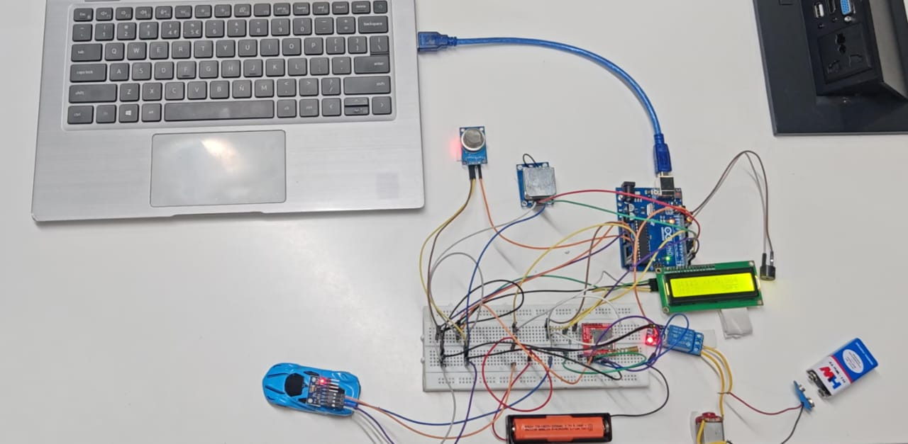
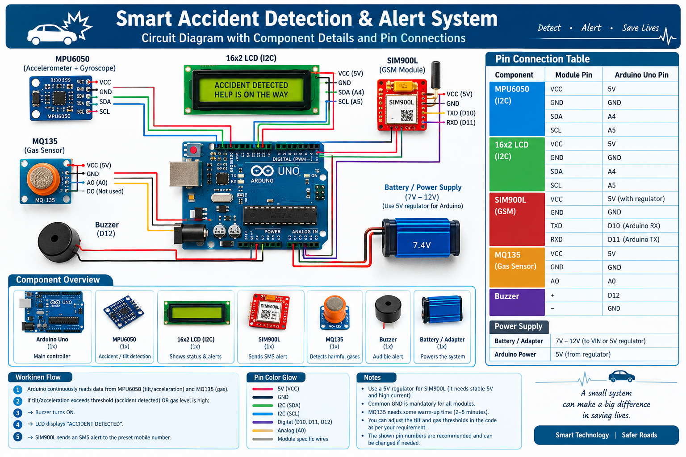

# 🚗 Smart Accident Detection & Alert System

An Arduino-based vehicle safety system that detects accidents using an MPU6050 sensor and sends an emergency SMS alert using the SIM900L GSM module.

## 📌 Project Overview

The Smart Accident Detection & Alert System is designed to detect a possible vehicle accident based on abnormal vehicle tilt.

When an accident is detected, the system:

- 🚨 Activates the buzzer
- 📟 Displays "ACCIDENT DETECTED" on the LCD
- 📱 Sends an emergency SMS using the SIM900L GSM module

## ⚙️ How It Works

```text
MPU6050
   ↓
Detect Abnormal Tilt
   ↓
Accident Detected
   ↓
Buzzer ON + LCD Alert + SMS Alert
```

## 🔧 Hardware Components

- Arduino Uno
- MPU6050 Accelerometer & Gyroscope
- SIM900L GSM Module
- 16×2 I2C LCD
- MQ135 Gas Sensor
- Buzzer
- Power Supply
- Connecting Wires


## 💻 Software & Technologies

- Arduino IDE
- Embedded C/C++
- I2C Communication
- GSM SMS Communication


## 🚨 Accident Detection

The MPU6050 sensor monitors the orientation of the system.

A tilt threshold of approximately **45°** is used in the prototype to identify a possible accident.

When the threshold is exceeded, the emergency alert sequence is activated.


## 📂 Project Structure

```text
smart-accident-detection-alert-system
│
├── Arduino_Code
│   └── accident_detection.ino
│
├── Circuit_Diagram
│   └── circuit_diagram.png
│
├── Demo
│   └── project_prototype_video.mp4
│
├── Documentation
│   └── Smart_Accident_Detection_Alert_System_Final.pdf
│
├── Images
│   └── project_protot
```

## 🖼️ Project Prototype




## 🔌 Circuit Diagram




## 🎥 Project Demo

[▶️ View Project Demonstration Video](Demo/project_prototype_video.mp4)


## 📄 Project Documentation

[📥 View Project Report](Documentation/Smart_Accident_Detection_Alert_System_Final.pdf)


## ✨ Key Features

- Real-time accident detection
- MPU6050-based tilt detection
- Emergency SMS notification
- LCD accident status display
- Audible accident alert
- Arduino-based safety prototype


## 🚀 Future Enhancements

- GPS-based accident location tracking
- Mobile application integration
- Cloud-based accident data storage
- AI-based accident severity analysis
- Automatic emergency service notification


## ⚠️ Project Status

This project is an **academic prototype** developed to demonstrate accident detection and emergency alert functionality.

Hardware connections, power requirements, GSM connectivity, and sensor thresholds should be verified before practical deployment.


## 👨‍💻 Project

**Smart Accident Detection & Alert System**

Built using Arduino Uno, MPU6050, SIM900L, LCD, MQ135 and buzzer.
